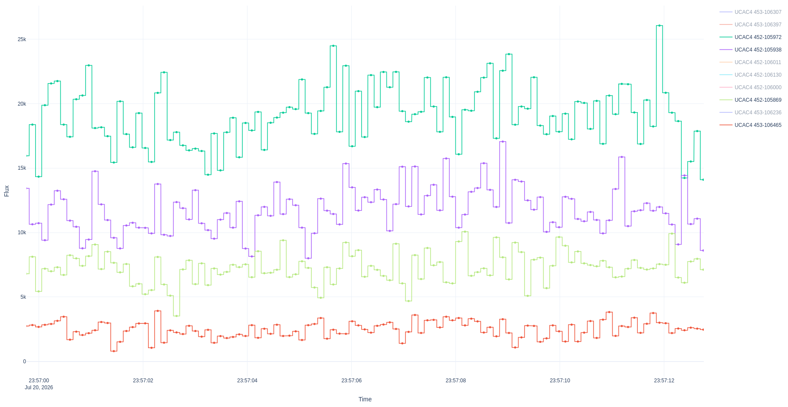
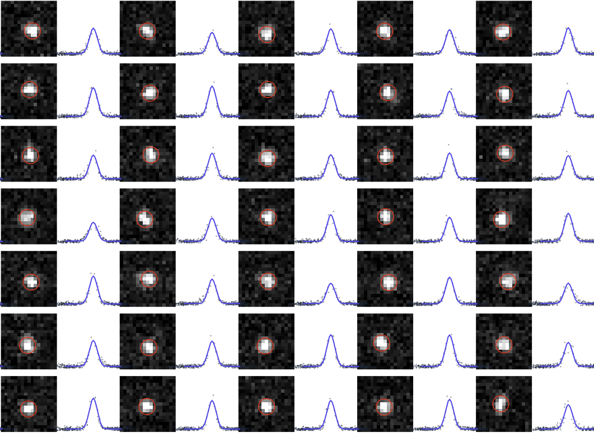

## LightFit

From FITS to lightcurves : least-squares fitting of star positions and gaussian PSF photometry
Run with `python lightfit.py`

---

## Pipeline

### [1] Data Loading (`import_data`)
* Reads data from standard FITS files, extracts timestamps from the image headers. To save time on subsequent runs, loaded data are cached locally.

### [2] Initial Drift Estimation (`estimate_drift`)
* Measures the pixel offset of a reference star between the first and last images. As an initial approximation, assuming a linear drift rate, it calculates a preliminary frame-by-frame offset map. It then creates a preliminary "stacked" image by shifting and averaging all frames, to show an high-SNR image.

### [3] Guide Stars & Field Alignment (`fit_guide_stars` & `fit_frame_transformations`)
* Determines the position, size, and brightness of guide stars, and computes field rotation and translation for every frame.
* 
  1. Isolates local patches around guide stars across all images.
  2. Fits a two-dimensional Gaussian profile to each guide star:
     **Model:** I = B + A * exp( - r^2 / (2 * s^2) )
  3. Adjusts the brightness A, local background B, center position (xc,yc), and star width s to best fit raw pixel values.
  4. Using the center positions of these guide stars, a global frame transformation (Dx, Dy, and Theta) relative to Frame 0 is derived for every frame.

### [4] Guided Stars (`fit_guided_stars`)
* For fainter stars, locks the movement of target stars to the frame transformations established in Step 3. Only fits the star's initial location (x0,y0), overall profile width s, per-frame brightness A, and per-frame background B.

### [5] Lightcurve Extraction (`compute_lightcurves` & `save_results`)
* The total light (integrated flux) is computed from the fitted Gaussian parameters:
  **Total Light = 2 * Pi * A * s^2**
  The results are displayed and exported as a CSV file.

---

## Star PSF model

* Each star's light profile is modeled as a Gaussian with a local background:

$$I(x, y) = B + A \exp\left( -\frac{(x - x_c)^2 + (y - y_c)^2}{2s^2} \right)$$

* For the **guide** stars, xc[i] and yc[i] are adjusted for all frames
* For the **guided** stars, only xc[0] and yc[0] are adjusted, and the center positions in other frames follow the guide stars.

---

## Parameters structure

For a sequence with N images and M stars, it optimizes:

* **Brightness (A):** N x M values (one peak value per star per frame).
* **Background (B):** N x M values (one background value per star per frame).
* **Profile Width (s):** M values (one shape parameter per star across all frames).
* **Base Position (xc, yc):** M reference positions (linked through the N frame transformations)

For the least-squares fit, the matrix of partial derivatives (Jacobian) is highly sparse. We use Compressed Sparse Row format (`csr_matrix`), via standard non-linear algorithms (`scipy.optimize.least_squares`).

---

## Inputs and Outputs

* **Input Files:** Directory containing `.fits` format images with `DATE-OBS`, `DATE-AVG`, `DATE-END` present in headers.
* **Intermediate Cache:** `frames.npy` (3D image array) and `times.csv` (timestamp list).
* **Primary Output:** `lightcurves.csv` containing time series columns for each fitted star.
